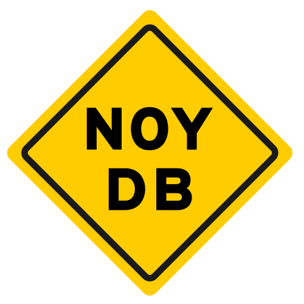
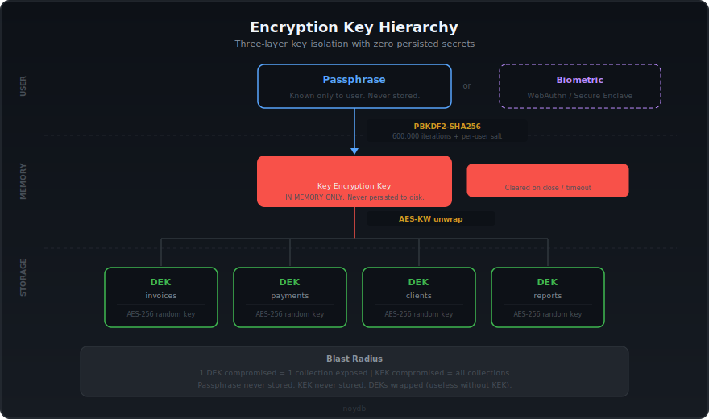
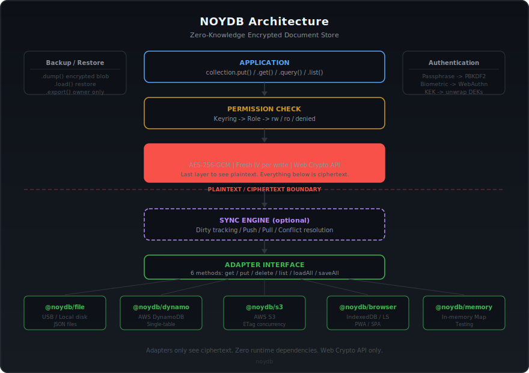

<div align="center">



# noy-db

## None Of Your DataBase
<sub><em>(formerly shortened as: "None Of Your <strong>Damn Business</strong>")</em></sub>

**Your data. Your device. Your keys. Nobody else's server.**

An encrypted, offline-first, **serverless** document store. The library lives inside your app, stores in whatever backend you choose, and nobody in the middle ever sees plaintext — not the cloud provider, not the sysadmin, not the database vendor. Not noy-db either.

🇹🇭 อ่านภาษาไทย: [`README.th.md`](./README.th.md)

[](https://www.npmjs.com/package/@noy-db/hub)
[](LICENSE)
[](https://nodejs.org)
[](https://www.typescriptlang.org)
[](#zero-dependencies)
[](#encryption)

</div>

---

## What makes noy-db different

- **🔒 Hard privacy by construction.** Stores only ever see ciphertext. AES-256-GCM with per-user keys derived from a passphrase via PBKDF2. Breach the cloud, subpoena the provider, lose the USB stick — **every one of those surfaces already holds ciphertext**. Zero crypto dependencies — only the Web Crypto API.
- **☁️ Serverless, runs anywhere.** No noy-db server. No Docker. No managed service. The library embeds in your app — ~30 KB, 0 runtime deps. Works in Node 18+, Bun, Deno, every modern browser, Cloudflare Workers, Electron, mobile PWAs.
- **📴 Offline-first.** Every operation works without network. Sync when you want to, to whatever you want to. Single code path for online and offline — no "online mode" to toggle.
- **👥 Multi-user, no auth server.** 5 roles (owner / admin / operator / viewer / client), per-collection permissions, key rotation on revoke. The keyring travels with the data.
- **🧩 One core, many bridges.** `@noy-db/hub` is the encrypted document-store core. 55 optional `to-*` / `in-*` / `on-*` / `as-*` packages let existing apps keep their preferred storage, framework, unlock method, and export format — without changing anything else.
- **🔐 Advanced crypto features.** Hierarchical per-record tiers (v0.18), deterministic encryption for searchable indexes (v0.19), WebRTC peer-to-peer sync (v0.20), AES-256-GCM blob store with deduplication, HKDF-keyed ETags, hash-chained audit ledger.
- **🧪 Thousand-plus tests, CI in under a minute.** Every store / integration / auth / export package is mock-tested — CI runs without AWS, Google Drive, SFTP servers, or any real service.

> **`@noy-db/hub` is the trust boundary.** Encryption happens in the core before data reaches any store. Every other package — `to-*`, `in-*`, `on-*`, `as-*` — is an optional adoption bridge that never sees plaintext.
>
> **Pre-1.0 stance.** The core privacy model, envelope format, keyrings, permissions, and query DSL are implemented and tested. Public APIs may still change based on adopter feedback before 1.0; data migrations and security-critical changes will be documented. No third-party cryptographic audit yet — that is a v1.0 target.

---

## 30-second vanilla example

The minimum — no framework, no cloud, nothing to install beyond two packages:

```ts
import { createNoydb } from '@noy-db/hub'
import { memory } from '@noy-db/to-memory'

const db = await createNoydb({
  store: memory(),
  user: 'alice',
  secret: 'correct-horse-battery-staple',
})

const vault = await db.openVault('acme')
const invoices = vault.collection<{ id: string; amount: number }>('invoices')

await invoices.put('inv-001', { id: 'inv-001', amount: 1200 })
console.log(await invoices.get('inv-001'))   // { id: 'inv-001', amount: 1200 }

await db.close()                               // clears keys from memory
```

**Swap storage with one line** — keep the rest identical:

```ts
// Persist to disk
import { jsonFile } from '@noy-db/to-file'
store: jsonFile({ dir: './data' })

// PostgreSQL
import { postgres } from '@noy-db/to-postgres'
store: postgres({ client: myPool })

// S3
import { s3 } from '@noy-db/to-aws-s3'
store: s3({ bucket: 'my-vaults', client: myS3Client })
```

→ See 20+ backends in **[Storage stores (`to-*`)](docs/packages/stores.md)**.

---

## Try it — playground + showcases

- **[`playground/cli/`](playground/cli/)** — guided 5-minute CLI walkthrough. `pnpm -C playground/cli demo`. Shows CRUD, multi-user, sync, backup.
- **[`playground/nuxt/`](playground/nuxt/)** — runnable Nuxt 4 reference app (invoices, multi-tenant, biometric unlock, magic-link client portal).
- **[`showcases/`](showcases/)** — 15 end-to-end tests that double as tutorials. Each file covers one topology: split-store routing, two-office sync, encrypted CRDT, year-end period closure, and more. Every test passes against real code — not pseudocode.

```bash
# Clone, install, run
git clone https://github.com/vLannaAi/noy-db.git
cd noy-db && pnpm install
pnpm demo                                      # interactive CLI tour
pnpm --filter @noy-db/showcases test           # run 14 showcase tests
```

---

## The four package families

Each prefix reads as a preposition — the mental model stays the same as you scale from one-file vaults to multi-tenant cloud deployments.

| Prefix | Reads as | What it is | Catalog |
|---|---|---|---|
| **`to-`** | *"data goes **to** a backend"* | **Storage destinations** — the only piece that touches ciphertext on the wire. 20 packages: file, browser, SQL, cloud, remote FS, iCloud, Drive, metrics, diagnostics. | [→ stores.md](docs/packages/stores.md) |
| **`in-`** | *"runs **in** a framework"* | **Framework integrations** — thin reactive bindings. React, Next.js, Vue, Nuxt, Pinia, Svelte, Zustand, TanStack Query/Table, Yjs CRDT, LLM tool-calling. | [→ integrations.md](docs/packages/integrations.md) |
| **`on-`** | *"you get **on** via this method"* | **Unlock / auth** — composable primitives. Passkeys (WebAuthn), OIDC split-key, magic links, TOTP, email OTP, recovery codes, Shamir k-of-n, duress + honeypot. | [→ auth.md](docs/packages/auth.md) |
| **`as-`** | *"export **as** XLSX / JSON / …"* | **Portable artefacts** — two-tier authorisation with audit ledger. CSV, Excel, XML, JSON, NDJSON, SQL dump, PDF blobs, ZIP, and the encrypted `.noydb` bundle. | [→ exports.md](docs/packages/exports.md) |

Plus the hub (`@noy-db/hub`) and specialised packages: `@noy-db/p2p` (WebRTC), `@noy-db/cli`, `create-noy-db` (scaffolder).

> **Maturity at a glance.** `@noy-db/hub` is **Core** — security-critical, highest test bar. `to-memory`, `to-file`, `to-browser-idb`, `to-aws-dynamo`, `to-aws-s3` are **Recommended** — first-class production paths. Most other satellites are **Bridges** — thin adapters proven in tests but less production-battled. P2P, niche stores, and unusual auth modes are **Experimental** — useful, validate before depending on them.

---

## Querying without SQL

The store never sees plaintext, so it never runs your query. The query DSL lives inside `@noy-db/hub` and runs **after decryption** — the storage backend stays a dumb, untrusted ciphertext store.

```ts
await invoices.query()
  .where('status', '==', 'issued')
  .where('clientId', '==', 'c-42')
  .orderBy('issuedAt', 'desc')
  .toArray()

// Intra-vault joins, live queries, aggregations, streaming
invoices.query().join<'client', Client>('clientId', { as: 'client' }).toArray()
invoices.query().where(...).live().subscribe(() => render())
invoices.query().groupBy('clientId').aggregate({ total: sum('amount') }).run()
for await (const r of invoices.scan()) { /* backpressure-friendly */ }
```

Joins are **intra-vault and core-side** — no backend ever inspects plaintext fields. Cross-vault correlation is explicit via `queryAcross`. Huge relational workloads are still better served by a real database; noy-db is for sensitive, small-to-mid datasets where the trust boundary matters more than query throughput.

---

## The 6-method store contract

```ts
get(vault, collection, id)
put(vault, collection, id, envelope, expectedVersion?)
delete(vault, collection, id)
list(vault, collection)
loadAll(vault)
saveAll(vault, data)
```

> If your existing storage can implement these six methods, it can store noy-db ciphertext. That is the full contract — 20+ shipped `to-*` stores (browser, file, SQL, object, remote-FS) are all built against it, and a custom one is `createStore(opts => ({ name, ...methods }))`.

---

## Install for common scenarios

```bash
# Development / testing — in-memory, no persistence
pnpm add @noy-db/hub @noy-db/to-memory

# Local CLI / Node service — files on disk
pnpm add @noy-db/hub @noy-db/to-file

# Browser app with IndexedDB
pnpm add @noy-db/hub @noy-db/to-browser-idb

# Nuxt 4 + Pinia — the happy path
pnpm add @noy-db/in-nuxt @noy-db/in-pinia @noy-db/hub @noy-db/to-browser-idb @pinia/nuxt pinia

# React / Next.js
pnpm add @noy-db/in-nextjs @noy-db/in-react @noy-db/hub @noy-db/to-browser-idb

# Offline-first with cloud sync
pnpm add @noy-db/hub @noy-db/to-file @noy-db/to-aws-dynamo
```

For the full Nuxt walkthrough see [`docs/guides/getting-started.md`](docs/guides/getting-started.md). For the multi-backend topology story see [`docs/guides/topology-matrix.md`](docs/guides/topology-matrix.md).

---

## Runs on whatever you've got

| Platform | Runtime | Default backend |
|---|---|---|
| 🖥️ Desktop (macOS / Linux / Windows) | Node 18+, Bun, Deno | [`to-file`](docs/packages/stores.md) |
| 📱 Mobile browser | Safari 14+, Chrome 90+ | [`to-browser-idb`](docs/packages/stores.md) |
| 🌐 Desktop browser | Chrome, Firefox, Safari, Edge | [`to-browser-idb`](docs/packages/stores.md) |
| ⚡ PWA / offline web app | Service Worker + browser | [`to-browser-idb`](docs/packages/stores.md) |
| 🖧 Server (headless) | Node 18+ | [`to-file`](docs/packages/stores.md) / [`to-aws-dynamo`](docs/packages/stores.md) / [`to-postgres`](docs/packages/stores.md) |
| 💾 USB stick / removable disk | Any OS + any runtime | [`to-file`](docs/packages/stores.md) |
| 🔌 Electron / Tauri | Desktop shell | [`to-file`](docs/packages/stores.md) |
| ☁️ Cloudflare Workers | Edge JS | [`to-cloudflare-d1`](docs/packages/stores.md) + [`to-cloudflare-r2`](docs/packages/stores.md) |
| 🧪 Tests / CI | Any JS runtime | [`to-memory`](docs/packages/stores.md) |

Minimum requirements: a JavaScript engine and the Web Crypto API. That's it.

---

## Hard privacy is the point

In privacy engineering there's a distinction worth naming.

- **Soft privacy** is a promise. A provider pledges to protect your data — by policy, by staff training, by a compliance certificate on the wall. You trust the policy, the people, the future owners, the jurisdiction, the subpoena response, the breach-response team on their worst day.
- **Hard privacy** removes the need for that trust. Nobody else *can* break the promise because nobody else is in a position to. They don't have the keys. They never had the keys.

noy-db is a hard-privacy tool. The only party that can read a record is the party holding the passphrase. That holds whether your cloud is breached, a sysadmin inspects the table, a court compels the provider, a laptop is stolen, or a backup is left on café Wi-Fi — **every one of those surfaces already holds ciphertext**.

There is no "encrypted in transit, briefly decrypted at rest for processing" step. There is no support engineer at noy-db with a recovery key — we do not run a service and we do not possess any key. The KEK exists in your process memory for the length of a session and is destroyed when you call `db.close()`.

This matters to an individual keeping private journals, medical notes, immigration paperwork, legal correspondence, or financial records. It matters a great deal more to an **organisation** that holds other people's sensitive data as a fiduciary — a law firm, an accounting practice, a clinic, a small newsroom, a union office, a humanitarian NGO — and cannot, in good conscience, hand that data to a third-party service whose incident response, jurisdiction, and future acquirer they don't control.

### A note on the ethics of hard privacy

Strong encryption is a dual-use technology. The same guarantees that protect dissidents, journalists, abuse survivors, clinicians' patients, and every ordinary person's private life can also shield conduct that is unlawful or harmful. We do not pretend otherwise.

Our position: **the capacity to keep one's own records, thoughts, and correspondence private from everyone else — including one's government, one's employer, and the company selling one the software — is foundational. It is bound up with personal autonomy itself, and it is a right, not a feature we chose to grant.**

noy-db does not inspect your data. It cannot — that is the architectural point. What you choose to store in a noy-db vault, and what you do with it, is your business. If you are using noy-db in a context where you have legal or professional obligations — GDPR, PDPA, HIPAA, PCI-DSS, retention, lawful-access rules, auditability, tax record-keeping — those obligations remain yours to meet under the law of wherever you operate.

---

## Encryption

<picture>
  
</picture>

| Layer | Algorithm | Purpose |
|---|---|---|
| Key derivation | PBKDF2-SHA256 (600K iterations) | Passphrase → KEK |
| Key wrapping | AES-KW (RFC 3394) | KEK wraps/unwraps DEKs |
| Data encryption | AES-256-GCM | DEK encrypts records |
| IV generation | CSPRNG | Fresh 12-byte IV per write |
| Integrity | HMAC-SHA256 | Presence channel + blob eTags |

**Zero crypto dependencies.** Everything uses `crypto.subtle` — built into Node 18+ and modern browsers.

---

## Roles & permissions

| Role | Read | Write | Grant | Revoke | Export |
|---|:-:|:-:|:-:|:-:|:-:|
| **owner** | all | all | all roles | all | yes |
| **admin** | all | all | operator, viewer, client, admin | admin and below | yes |
| **operator** | granted collections | granted collections | — | — | ACL-scoped |
| **viewer** | all | — | — | — | yes |
| **client** | granted collections | — | — | — | ACL-scoped |

Every mutation (grant, revoke, rotate, elevate) writes a hash-chained audit ledger entry. Hierarchical per-record classification tiers (`collection.elevate()` / `demote()` / `delegate()` / invisibility / ghost modes) are covered in `docs/spec/archive/issue-205.md` and the follow-ups under `docs/spec/archive/issue-2{06..10}.md`.

---

## Not for

- Million-row analytics workloads.
- Server-side SQL over plaintext — the store is deliberately blind.
- Workloads that need the storage backend itself to run joins, filters, or aggregations over plaintext.
- Search-heavy workloads unless the searchable-index privacy tradeoff (opt-in deterministic encryption from v0.19) is acceptable for your threat model.
- Teams that need **audited** cryptography today — noy-db has not yet had a third-party cryptographic audit. That is a v1.0 target.

Serious use of noy-db is for sensitive, small-to-mid datasets where the privacy boundary matters more than query throughput.

---

## Architecture

<picture>
  
</picture>

Stores **only see ciphertext**. Encryption happens in core before data reaches any backend — a DynamoDB admin, an S3 bucket owner, or whoever finds the USB stick all see encrypted blobs.

---

## International project, Thailand focus

noy-db is an international open-source project developed and maintained from **Thailand**. The first production consumer is a regional accounting firm in Chiang Mai — the library's design assumptions (offline-first, multi-user, sensitive financial data, per-tenant isolation, USB-based workflows for poor connectivity) come directly from that real-world deployment.

- Thai text handles cleanly across every API — record IDs, field values, user display names, error messages, backup files.
- Buddhist Era dates (`พ.ศ. 2568`), Thai numerals (`๐ ๑ ๒ ๓`), and THB formatting flow through `Intl.*` — no special-case code.
- Thai translation of the scaffolder wizard (tracked, shipping soon). Docs available in English and Thai.

Open an issue or PR in any language — we'll work with it.

---

<a name="zero-dependencies"></a>
## Zero dependencies

Every package has zero runtime dependencies. SDKs like `@aws-sdk/client-dynamodb`, `ssh2`, `pg`, `mysql2`, `zustand`, `react`, `vue`, `@tanstack/query-core` are peer dependencies — you already have them in your app.

The hub package itself uses only `crypto.subtle`, which is built into every target runtime (Node ≥ 18, Bun, Deno, modern browsers, Cloudflare Workers).

---

## Roadmap + spec archive

- [`ROADMAP.md`](ROADMAP.md) — version timeline and what's next.
- [`docs/HANDOVER.md`](docs/HANDOVER.md) — session-to-session notes for contributors.
- [`docs/spec/INDEX.md`](docs/spec/INDEX.md) — **the why behind every feature.** Every issue, milestone, discussion, and PR preserved in-repo as markdown. `grep docs/spec/archive` is the canonical way to find design rationale and rejected alternatives.

---

## Where to go next

| If you want to… | Read |
|---|---|
| try noy-db in 5 minutes | [`docs/guides/getting-started.md`](docs/guides/getting-started.md) |
| choose a path for your app | [`docs/guides/START_HERE.md`](docs/guides/START_HERE.md) |
| pick a storage backend | [`docs/packages/stores.md`](docs/packages/stores.md) |
| pick a framework integration | [`docs/packages/integrations.md`](docs/packages/integrations.md) |
| understand the security model | [`docs/reference/architecture.md`](docs/reference/architecture.md) |
| map a deployment topology | [`docs/guides/topology-matrix.md`](docs/guides/topology-matrix.md) |
| see real workflows | [`showcases/`](showcases/) |
| check what is stable or next | [`ROADMAP.md`](ROADMAP.md) |
| audit design decisions | [`SPEC.md`](SPEC.md) + [`docs/spec/INDEX.md`](docs/spec/INDEX.md) |

---

## License

[MIT](LICENSE)

---

<div align="center">
  <sub>Your data. Your device. Your keys. <b>None Of Your DataBase.</b></sub>
  <br>
  <sub><em>(Originally, and still occasionally: "None Of Your <strong>Damn Business</strong>".)</em></sub>
</div>
