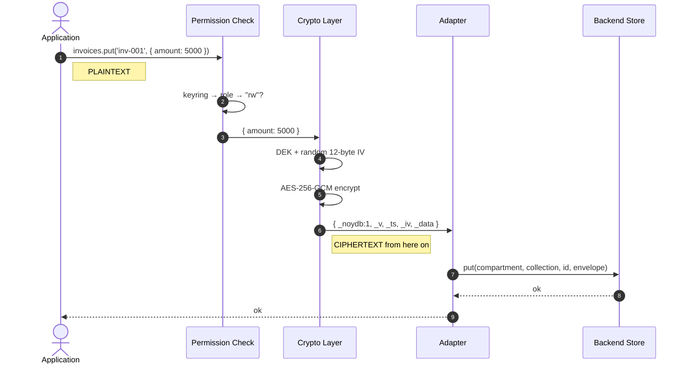
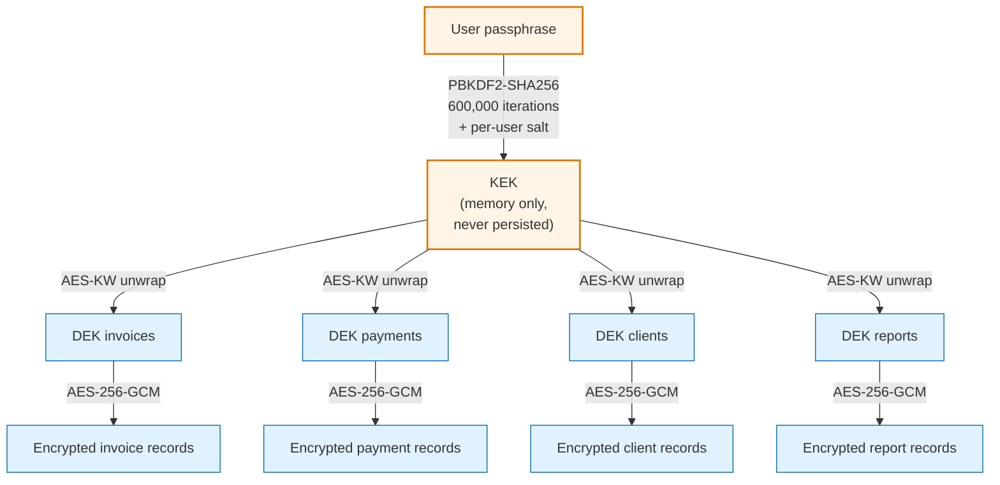
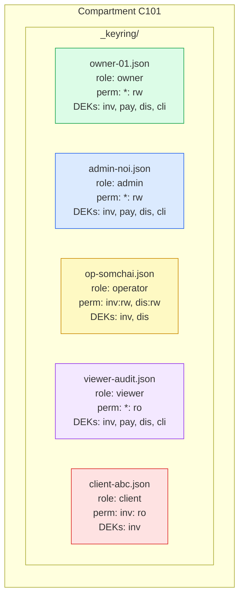
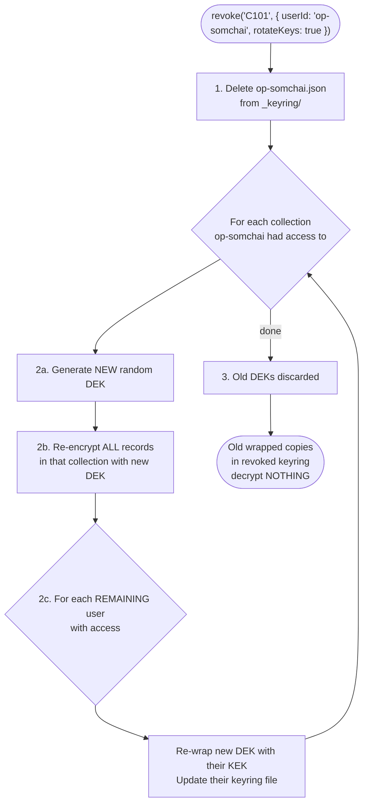
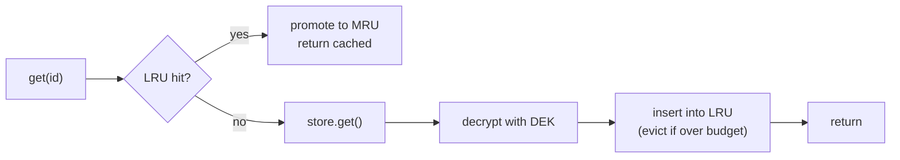
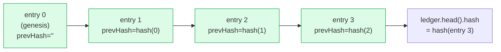
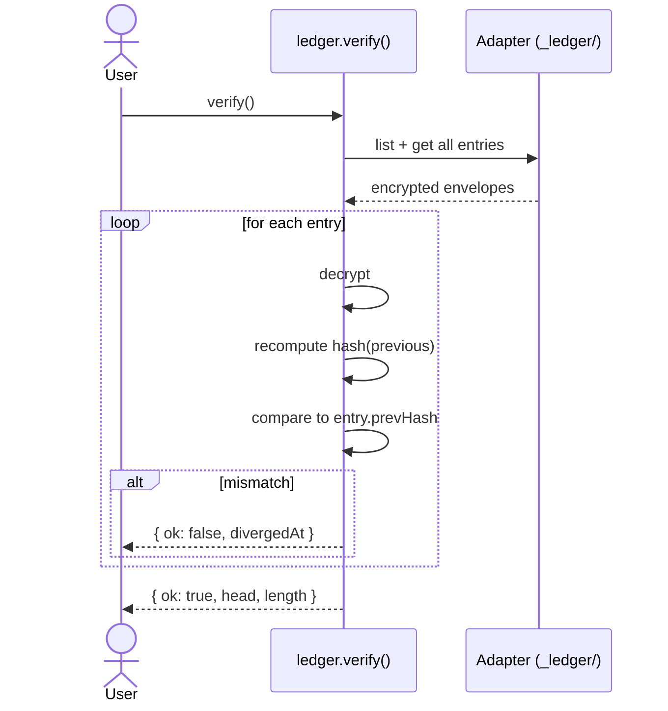
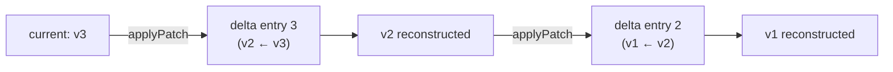

# Architecture

How NOYDB stores, encrypts, and protects your data.

> Related: [Roadmap](../ROADMAP.md) · [Deployment topologies](./topologies.md) · [Spec](../SPEC.md)

---

## Core ideas

| Idea                  | What it means                                                                                          |
|-----------------------|--------------------------------------------------------------------------------------------------------|
| Zero-knowledge        | Backends store ciphertext only. The server, the disk, the cloud — none of them ever see plaintext.   |
| Memory-first          | Eager hydration is the default. Opt into lazy mode via `cache: {...}` for larger collections — see [Caching and lazy hydration](#caching-and-lazy-hydration). Target scale for eager mode: 1K–50K records. |
| Pluggable backends    | One 6-method store contract. Same API for USB, DynamoDB, S3, browser storage, or your own.            |
| Multi-user ACL        | 5 roles, per-collection permissions, portable keyrings. Revocation rotates keys.                       |
| Zero runtime crypto deps | Web Crypto API only. Never an npm crypto package.                                                   |

---

## Data flow — write path



The crypto layer is the **last** layer to see plaintext. Adapters never receive cleartext — they handle opaque envelopes.

---

## Key hierarchy



**Compromise model:**

| Compromised        | Effect                                          |
|--------------------|-------------------------------------------------|
| One DEK            | One collection exposed                          |
| KEK                | All collections exposed (this user)             |
| Passphrase         | KEK derivable → all collections (this user)     |

The passphrase is **never** stored. The KEK is **never** persisted. DEKs are stored only in *wrapped* form inside keyring files — useless without the KEK.

---

## Multi-user access model



**Permission matrix:**

| Operation | owner | admin    | operator | viewer | client  |
|-----------|:-----:|:--------:|:--------:|:------:|:-------:|
| read      | all   | all      | granted  | all    | granted |
| write     | all   | all      | granted  | —      | —       |
| grant     | all   | ↓ roles* | —        | —      | —       |
| revoke    | all   | ↓ roles* | —        | —      | —       |
| export    | yes   | yes      | granted  | yes    | granted |
| rotate    | yes   | yes      | —        | —      | —       |

`↓ roles*` = admin can grant/revoke any role except `owner`, **including other admins**. Bounded lateral delegation: a grant cannot widen access beyond what the grantor holds (`PrivilegeEscalationError`), and revoking an admin cascades to every admin they transitively granted (`cascade: 'strict'` default, `cascade: 'warn'` opt-in for diagnostic dry runs).

`export` is ACL-scoped via `exportStream()`/`exportJSON()` — every role that can read collections can export what they can read. Operators and clients see only their explicitly-permitted collections.

---

## Key rotation on revoke

When a user is revoked with `rotateKeys: true`, every collection they had access to gets a fresh DEK. Their old wrapped DEKs become permanently useless.



---

## Encrypted record envelope

What every store actually holds:

```json
{
  "_noydb": 1,
  "_v": 3,
  "_ts": "2026-04-04T10:00:00.000Z",
  "_iv": "a3f2b8c1d4e5...",
  "_data": "U2FsdGVkX1+..."
}
```

| Field    | Encrypted? | Purpose                                                       |
|----------|:----------:|---------------------------------------------------------------|
| `_noydb` | no         | Format version (currently `1`)                                |
| `_v`     | no         | Record version for optimistic concurrency                     |
| `_ts`    | no         | ISO timestamp; lets the sync engine compare without keys      |
| `_iv`    | no         | 12-byte AES-GCM IV (random per encrypt; never reused)         |
| `_data`  | **yes**    | AES-256-GCM ciphertext of the record body                     |

`_v` and `_ts` are unencrypted by design — the sync engine needs to compare versions and timestamps without holding the encryption key.

---

## Caching and lazy hydration

A `Collection` has two hydration modes:

**Eager (default):** `openVault()` loads every record from the store, decrypts it, and keeps it in memory. `list()` and `query()` are `Array.filter` over the in-memory map. Indexes are allowed.

**Lazy:** triggered by passing `cache: { maxRecords, maxBytes }` at collection construction. Records are fetched on demand and cached in an LRU keyed by `(vault, collection, id)`. Eviction is O(1) via a `Map` + delete/set promotion. On cache miss, `get(id)` hits the store, decrypts, and populates the LRU. `list()` and `query()` throw — use `scan()` (async iterator, bypasses the LRU) or `loadMore()` (via `listPage`, populates the LRU) instead. Indexes in lazy mode are supported as of — see [Indexes in lazy mode](#indexes-in-lazy-mode-v022) below.

`prefetch: true` restores eager behavior even when `cache` is set, which is useful for small compartments inside a larger lazy database.

### Indexes in lazy mode

Lazy-mode collections accept the same `indexes: ['field', …]` declaration
as eager collections. Each declared field materialises a side-car record
per main record in the reserved id namespace `_idx/<field>/<recordId>`,
encrypted with the collection DEK using the standard `{ _noydb, _v, _ts,
_iv, _data }` envelope. The decrypted body is `{ value, writtenAt }` —
`field` and `recordId` live in the record id, not the body.

On first `.query()` / `.where()` / `.orderBy()` against an indexed field
in a session, the hub lists every id in the collection, filters to ones
starting with `_idx/<field>/`, decrypts those envelopes, and populates
an in-memory `PersistedCollectionIndex`. Subsequent queries hit the
mirror — equality lookup is O(matches) + `get()` per candidate, sort is
a single JS `Array.sort` on the pre-decrypted values.

Composite queries (`.where(f1, …).orderBy(f2, …)` with `f1 ≠ f2`)
require both fields indexed; the query planner throws
`IndexRequiredError` at build time otherwise. Silent fallback to
`scan()` is rejected deliberately — hiding the performance cliff
defeats the entire feature.

Writes on an indexed lazy collection do the main `put` first, then
sequentially put each index side-car (no CAS on the side-cars). Failures
are surfaced via the `index:write-partial` event and recovered by
`reconcileIndex(field)` — the read-time dangling-id filter makes
false-positive side-cars invisible in the meantime.

Storage footprint at Pilot-2 scale (50K records, 3 indexed fields) is
~15 MB on disk + ~10 MB decrypted in RAM for the mirror. The mirror is
NOT evicted by the lazy LRU — it has its own budget.



The cache stores decrypted plaintext. It never leaves process memory and is cleared on `db.close()`.

---

## Pinia layering

The Pinia integration sits *on top of* `Collection` without weakening the encryption boundary. A `defineNoydbStore` call produces a Pinia store whose reactive state is a view of the collection's in-memory map (eager mode) or LRU (lazy mode):

```mermaid
flowchart TB
    Component["Vue component"]
    Store["Pinia store<br/>(defineNoydbStore)"]
    Col["Collection&lt;T&gt;"]
    Crypto["Crypto layer<br/>(DEK + IV per record)"]
    Adapter["Adapter"]

    Component -->|items, query(), add(), remove()| Store
    Store -->|get/put/delete/scan| Col
    Col --> Crypto
    Crypto -->|ciphertext only| Adapter
```

The Pinia store never touches crypto directly — every operation goes through `Collection`, which means every invariant documented above (DEK per collection, fresh IV per encrypt, backing store sees only ciphertext) still holds. The only thing the Pinia layer adds is Vue reactivity: mutations push into `items`, and live queries recompute via `ref`/`computed`.

SSR safety: the `@noy-db/nuxt` runtime plugin is registered with `mode: 'client'`, so the server bundle contains zero crypto symbols. During SSR, stores return empty reactive refs; the client hydrates after decrypt.

---

## Hash-chained ledger

Every compartment owns an encrypted, append-only audit log stored in the internal `_ledger/` collection. Every `put` and `delete` appends one entry; entries are linked by `prevHash = sha256(canonicalJson(previousEntry))` so any modification breaks the chain at the modified position.



Each entry is stored as an encrypted envelope (same `EncryptedEnvelope` shape as data records, encrypted with a per-compartment ledger DEK). The plaintext payload is:

```ts
interface LedgerEntry {
  index: number          // sequential, 0-based
  prevHash: string       // hex sha256 of canonical JSON of previous entry
  op: 'put' | 'delete'
  collection: string
  id: string
  version: number
  ts: string             // ISO timestamp
  actor: string          // user id
  payloadHash: string    // hex sha256 of the encrypted envelope's _data field
  deltaHash?: string     // optional — present for non-genesis puts (#44)
}
```

**Why hash the ciphertext, not the plaintext?** `payloadHash` is over the encrypted bytes, not the decrypted record. This means:

1. A user (or auditor) can verify the chain against the stored envelopes **without any decryption keys** — the store already holds only ciphertext, so hashing the ciphertext keeps the ledger at the same privacy level as the store.
2. The hash is deterministic per write because we always use a fresh IV — different writes of the same record produce different ciphertexts and different hashes.
3. Tamper detection works: if an attacker modifies a stored ciphertext to flip a record, the recomputed `payloadHash` no longer matches the ledger entry. The cross-check in `verifyBackupIntegrity()` catches it.

### Verification



`compartment.verifyBackupIntegrity()` runs both `ledger.verify()` AND a data envelope cross-check (recomputes `payloadHash` for every current record and compares to the latest matching ledger entry). This catches three independent attack surfaces: chain tampering, ciphertext substitution, and out-of-band writes that bypassed `Collection.put`.

### Delta history

Non-genesis puts also store a **reverse** JSON Patch in `_ledger_deltas/<paddedIndex>` that describes how to undo the put. Walking the chain backward applies these patches to reconstruct any historical version from the current state — storage scales with edit size, not record size.



Reverse patches were chosen over forward patches because the current state is already live in the data collection. Forward patches would need a base snapshot duplicating the data — reverse patches reuse what's already there.

### Single-writer assumption

The ledger assumes a single writer per compartment. Two concurrent `append()` calls would race on the "read head, write head+1" cycle and could produce a broken chain. The single-writer model is fine for the current use cases (one Nuxt app per session, one CLI tool at a time); multi-writer hardening is tracked on the roadmap.

---

## Adapter interface

Every store implements exactly six async methods:

```ts
interface NoydbAdapter {
  name: string;

  get(compartment: string, collection: string, id: string)
    : Promise<EncryptedRecord | null>;

  put(compartment: string, collection: string, id: string,
      envelope: EncryptedRecord, expectedVersion?: number)
    : Promise<void>;

  delete(compartment: string, collection: string, id: string)
    : Promise<void>;

  list(compartment: string, collection: string)
    : Promise<EncryptedRecord[]>;

  loadAll(compartment: string)
    : Promise<CompartmentSnapshot>;

  saveAll(compartment: string, data: CompartmentSnapshot)
    : Promise<void>;

  // Optional extensions:
  ping?(): Promise<boolean>;                                    // optional
  listPage?(c, col, cursor?, limit?): Promise<PageResult>;      // optional
}
```

The contract is intentionally tiny. Building a custom store is `createStore(opts => ({ name, get, put, delete, list, loadAll, saveAll }))` and you're done.

---

## Threat model (summary)

| Threat                          | Defense                                                                       |
|---------------------------------|-------------------------------------------------------------------------------|
| Disk/cloud breach               | Ciphertext only; no key material at rest                                      |
| Stolen keyring file             | Useless without the user's passphrase (PBKDF2 at 600K iterations)             |
| Tampering with stored records   | AES-GCM authentication tag fails on decrypt → throws                          |
| Tampering with the audit log    | Hash-chain breaks on any modification; `verifyBackupIntegrity()` catches data envelope swaps too |
| Tampering with a backup file    | Embedded `ledgerHead.hash` + post-load chain verification                     |
| Bad data persisted by mistake   | Standard Schema v1 validation runs before encryption on `put()`               |
| Orphaned cross-collection refs  | `ref()` declarations enforce strict/warn/cascade per field                    |
| Revoked user retains old copies | Key rotation makes their old wrapped DEKs decrypt nothing                     |
| IV reuse                        | Fresh 12-byte random IV per encrypt; never reused                             |
| Quantum (Grover's)              | AES-256 → 128-bit effective security; safe for the foreseeable future         |
| Leaked indexed field names      | Accepted — the only new store-observable metadata introduced by lazy-mode indexes. Field names per collection are visible via side-car id prefixes; value distribution is NOT visible (side-car id contains `recordId`, not a value hash). |

What NOYDB **doesn't** defend against:
- Compromised client device with active session (KEK is in memory by definition)
- Malicious code with access to `crypto.subtle` in the same context
- Side-channel attacks against Web Crypto implementations

---

---

## Schema validation

`@noy-db/hub` accepts any [Standard Schema v1](https://standardschema.dev) validator (Zod, Valibot, ArkType, Effect Schema, or a hand-rolled `{ '~standard': { validate: … } }` object) as the `schema` option on `vault.collection()`. The validator fires **on every `put`** (rejects wrong-shape writes) AND **on every decrypted read** (catches silent drift from older records). Wrong-shape data never gets persisted or returned.

```ts
import { z } from 'zod'

const Invoice = z.object({
  id: z.string().min(1),
  clientId: z.string(),
  amount: z.number().positive(),
  status: z.enum(['draft', 'open', 'paid', 'overdue']),
  issueDate: z.string(),
})

const invoices = vault.collection<z.infer<typeof Invoice>>('invoices', { schema: Invoice })
```

### What it validates, and when

| Call site | Direction | What it catches |
|-----------|-----------|-----------------|
| `put(id, record)` | **Input** — before encrypt | Caller passed wrong-shape data |
| `get(id)` / `list()` / `query().*` / `scan()` / `listPage()` | **Output** — after decrypt | Historical record doesn't match *current* schema (drift during schema evolution) |
| `getVersion()` / `history()` | *(skipped)* | History reads are expected to predate the current schema |

Input validation is the obvious case. Output validation matters when you evolve the schema — records written under v1 of the shape might be missing a field v2 requires. Returning them silently would let the consumer render a broken UI for a stale record.

### `SchemaValidationError`

```ts
class SchemaValidationError extends NoydbError {
  code: 'SCHEMA_VALIDATION_FAILED'
  direction: 'input' | 'output'
  issues: readonly StandardSchemaV1Issue[]
}
```

Consumer-side error renderers (Zod → `fieldErrors`, Valibot → `flatten()`, etc.) all work on `err.issues` — the library passes the raw issue list through untouched.

### Schema evolution — handling the output case

1. **Additive-only changes** — adding an *optional* field never breaks older records. Adding a *required* field with a default likewise.
2. **Transform-with-default** via `z.coerce` / `default()` — older records without the field get a sensible value when decoded.
3. **Dual-shape union** — when the new shape is incompatible with the old, use a discriminated union keyed on a `schemaVersion` field.
4. **Migration script** — a one-shot that reads every record with `{ skipValidation: true }`, transforms, writes back under the new shape.

### Runtime cost

Measured overhead on a representative Zod schema of 12 fields, 1,000 records: **~1.2%** of total `put` time. Reads are similar. Validation is dominated by crypto, not schema checks. Use `{ skipValidation: true }` on specific reads where you've already validated the data is shape-correct.

---

## Schema-agnostic design

noy-db is **schema-agnostic by policy**. The hub enforces an encryption invariant (ciphertext at rest, per-user keyring) and a query contract (`Collection<T>` with `put` / `get` / `list` / `query`), but it has no opinion on what `T` *means* — EU Peppol UBL, US IRS 1099, HL7 FHIR, any of it. That's deliberate.

### Why we don't ship domain schemas under `@noy-db/`

Every market has a regulated invoice format, a jurisdiction-specific identifier layout, a domain-specific cadence. Publishing even one under the `@noy-db/` scope would commit the core to:

- Tracking that standard's revisions (typically every 24–36 months).
- Handling regulator interpretation changes.
- Fielding bug reports that are really domain questions, not crypto or store questions.
- A growing tail of *every other* standard anyone asks for next.

Schema-agnostic is the only policy that scales. Domain libraries belong to domain communities.

### Recommended naming convention for community schema packages

If you ship a schema preset and want discoverable naming that telegraphs compatibility:

```
@<your-scope>/noy-db-schema-<format-slug>
```

Examples: `@eu-b2b/noy-db-schema-peppol-ubl`, `@clinics-uk/noy-db-schema-hl7-fhir`. The convention is a suggestion, not a requirement. noy-db does not own the name, register the npm prefix, or audit the publish.

---

## i18n boundaries — what hub knows vs what you own

`@noy-db/hub` is **content-agnostic**. It knows the **shape** of multi-locale data (`i18nText` fields, dictionaries, `dictKey` descriptors) and it knows how to **store** and **resolve** it, but it never inspects *what* the content says. Translation, full-text search, locale-aware sorting, alternate calendars — all userland.

### Three layers

| Layer | What it knows | Where it lives |
|-------|---------------|----------------|
| **1. Shape** | Multi-locale data has N slots; which locales are required; how to resolve a locale map to a single value; stable identity vs render-time label | `@noy-db/hub/i18n` subpath |
| **2. Content** | The actual translated strings. Whether a character sequence is a valid translation. What language a string is in. | **Userland** — bridged into hub via the `plaintextTranslator` hook |
| **3. Locale-specific logic** | Alternate-era date conversion · fiscal calendars · RTL handling · plural rules · locale-aware collation · stemming · currency glyphs · stop words · phonetic matching | **Userland** — adopters build their own helpers or use general-purpose libraries (`date-fns`, `dayjs`, `Intl.*`). noy-db deliberately does not ship market-specific `locale-*` packages. |

Hub touches layer 1 only. Every language-specific function adopters might reach for is layer 2 or 3.

### The stable-key invariant

The content-agnostic guarantee rests on one design rule:

> **Identity is stable across locales. Labels are render-time.**

Concretely:
- `Collection` record ids are opaque strings — never localised.
- `dictKey` fields store the stable key (`'paid'`) — never the label (`'Paid'` / localised variant).
- Query operators compare stable keys, not labels.
- FK refs (`ref()`) target record ids, not display names.
- `groupBy` buckets by stable keys — bucket counts are identical whether you render in one locale or another.

A consumer who follows this rule gets a deployment that runs the same way in every locale. A consumer who puts localised strings into identity fields is opting out of this guarantee (queries break when the label changes, FKs dangle when a translator revises the string).

**The one documented exception.** Plaintext exports (`@noy-db/as-xlsx` and the wider `as-*` family) deliberately resolve `dictKey` values to locale labels on the way out. This is a render-time transform at the egress boundary, not a breach of the invariant.

### `plaintextTranslator` hook — the boundary

This is the one line in hub where userland-supplied logic runs over plaintext content. Consumer provides a function; hub invokes it, caches the result, writes an audit entry:

```ts
createNoydb({
  store: ...,
  plaintextTranslator: async ({ text, from, to, field, collection }) => {
    const translated = await myLLM.translate(text, { from, to })
    return translated
  },
})
```

Hub's responsibilities: invoke the hook when an `i18nText` field has `autoTranslate: true` and a required locale is missing; cache results; write an audit entry to the ledger (field + collection + mechanism + timestamp — **never content hashes**); clear the cache on `db.close()`.

Hub's *non*-responsibilities: ship any default translator (no SDK dependencies), retry on translator failure, validate output language, detect input language.

### Query ordering is byte-comparison, not locale-aware

`.orderBy(field, direction)` uses native JS comparators on the canonical bucket-key representation: numbers numeric, dates chronological, **strings byte-compared (code-point order, not locale-aware)**. If you need culturally-correct sort order for a specific script, wrap `orderBy` output with `Intl.Collator(locale).compare` in post-processing. Hub doesn't help — the in-memory cache is the index.

---

## Sync conflict resolution

`@noy-db/hub` has pluggable sync-conflict resolution. Pass `conflictPolicy` when declaring a collection.

### The 60-second pattern

```ts
// Option 1 — built-in string strategy
const invoices = vault.collection<Invoice>('invoices', {
  conflictPolicy: 'last-writer-wins',   // envelope with newer _ts wins
})

// Option 2 — custom merge function (decrypted T in, merged T out)
const notes = vault.collection<Note>('notes', {
  conflictPolicy: (local, remote) => ({
    ...local,
    text: `${local.text}\n\n---\n\n${remote.text}`,
    version: Math.max(local.version, remote.version) + 1,
  }),
})

// Option 3 — surface to UI, human picks
const urgent = vault.collection<Ticket>('urgent', { conflictPolicy: 'manual' })
db.on('sync:conflict', ({ id, local, remote, resolve }) => {
  const winner = await askUser(id, local, remote)
  resolve?.(winner === 'local' ? local : remote)
})
```

### When does a conflict fire?

| Event | Resolver invoked? |
|-------|-------------------|
| Local two-writer race on the same device | ❌ throws `ConflictError` at the `put` call (optimistic-lock mismatch) |
| `push` — local `_v` older than remote | ✅ |
| `pull` — remote `_v` newer than a locally-dirty record | ✅ |
| `pull` — remote newer than local, local NOT dirty | ❌ remote just wins cleanly |
| `pushFiltered` (partial sync) | ✅ same rules as `push` |

The resolver is a **merge point for parallel histories**, not a generic write-collision handler. Local races are the caller's job — catch `ConflictError`, re-read, reconcile, retry.

### The four built-in strategies

- **`'last-writer-wins'`** (timestamp-based) — the envelope with the larger `_ts` wins. Assumes reasonably-synced clocks.
- **`'first-writer-wins'`** (version-based, monotonic) — the envelope with the *lower* `_v` wins. Useful for append-only logs, immutable-after-submission records.
- **`'manual'`** (emit event, you resolve) — the sync engine emits `'sync:conflict'` with a `resolve(winner)` callback.
- **Custom merge function** `(local: T, remote: T) => T` — sees decrypted records. Return value is re-encrypted and assigned `_v = max(local._v, remote._v) + 1`.

### Multi-operator example

Two operators in different locations both edit the same record while offline. On reconnect, both sync. With LWW the later-timestamp write wins wholesale, losing the other operator's field-level edits. With a custom merge function field-level merges preserve both operators' changes:

```ts
conflictPolicy: (local, remote) => ({
  ...local, ...remote,
  amount: local.amount !== remote.amount ? Math.max(local.amount, remote.amount) : local.amount,
  status: local.status !== 'draft' ? local.status : remote.status,
  tags: [...new Set([...(local.tags ?? []), ...(remote.tags ?? [])])],
  notes: [local.notes, remote.notes].filter(Boolean).join('\n---\n'),
})
```

For any multi-operator deployment: **either pick `'manual'` and build a UI, or write a domain-aware merge function**. Don't ship LWW to production unless you accept that concurrent edits lose data.

### Events emitted by the sync engine

| Event | When | Payload |
|-------|------|---------|
| `'sync:push'` | After every `push()` | `PushResult { pushed, conflicts: Conflict[], status }` |
| `'sync:pull'` | After every `pull()` | `PullResult { pulled, conflicts, status }` |
| `'sync:conflict'` | `conflictPolicy: 'manual'` OR a custom resolver returns `null` | `Conflict { vault, collection, id, local, remote, localVersion, remoteVersion, resolve? }` |
| `'change'` | After every local put/delete | `ChangeEvent` |

The `PushResult.conflicts` / `PullResult.conflicts` arrays let you audit every conflict regardless of policy. `'sync:conflict'` is for interactive resolution only.

### Pitfalls

- **Don't expect the resolver on local races** — `ConflictError` on `put` is a CAS violation, not a sync conflict.
- **Don't forget `resolve?.()` in the `'manual'` handler** — without it, the conflict stays queued and the record stays stale.
- **Merge functions must be pure.** Two devices running the same merge on the same inputs must produce the same output, or the conflict keeps re-emerging.
- **The policy is set at `vault.collection()` declaration time** — changing it at runtime for a collection isn't supported; re-declare the collection reference.

---

## What's next

The forward roadmap continues in [`ROADMAP.md`](../ROADMAP.md).
