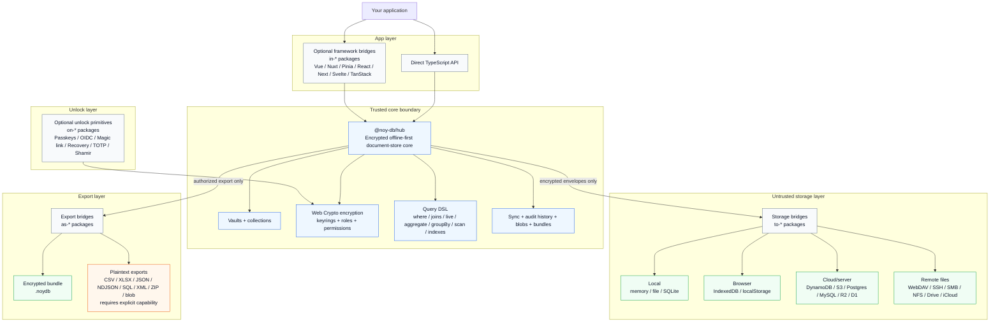
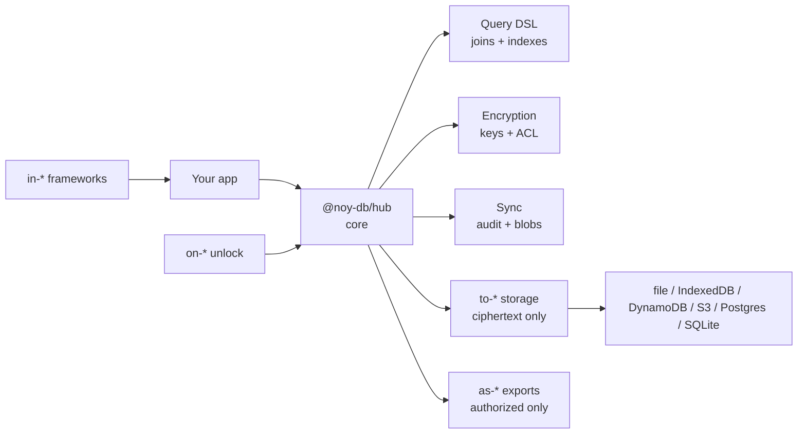

# Package Overview Infographic Proposal

This note proposes a simplified first-sight diagram for `noy-db`.

The goal is to help a new adopter understand the ecosystem in one glance
without feeling that they must understand every package before trying the
library.

## What The First Diagram Should Do

The first package overview graphic should answer:

1. What is the core?
2. Where is the security boundary?
3. Why are there many packages?
4. Which packages do I install first?
5. How does this fit my existing app?

It should not try to show every package by name. The full package list belongs
in package catalogs, not the first infographic.

## Recommended Message

The diagram should communicate:

> One core. Many bridges.

`@noy-db/hub` is the encrypted document-store core. The package families around
it are optional bridges:

- `to-*`: store encrypted envelopes in existing storage
- `in-*`: use noy-db inside existing frameworks
- `on-*`: unlock keys with existing auth methods
- `as-*`: export authorized data as portable artifacts

This makes the long npm package list feel intentional.

## What Should Be In The Picture

Include:

- application/user code
- framework bindings (`in-*`)
- core (`@noy-db/hub`)
- the trust boundary
- major core responsibilities:
  - vaults/collections
  - encryption/keyrings/permissions
  - query DSL/joins/indexes
  - sync/audit/blobs
- storage adapters (`to-*`)
- auth/unlock primitives (`on-*`)
- export packages (`as-*`)
- example adoption paths:
  - browser/PWA
  - desktop/USB
  - cloud/server

## What Should Not Be In The First Picture

Do not include:

- every package name
- every cryptographic primitive
- every role/permission detail
- every sync conflict mode
- every export format
- every roadmap milestone
- archived issue history
- deep bundle format details
- advanced tier/delegation modes

Those belong in linked diagrams or deeper docs.

## Linked Follow-Up Diagrams

The first infographic should link to deeper visuals:

| Topic | Better diagram |
|---|---|
| key derivation and wrapping | key hierarchy diagram |
| encrypted record shape | envelope format diagram |
| storage/sync topology | deployment profiles or topology matrix |
| npm ecosystem | package map |
| threat model | architecture diagram |
| query DSL | query guide diagram |
| export boundary | export/as-* guide |

The overview diagram should be the front door, not the whole building.

## Draft Diagram

## Simpler Website Version

For the README or npm package pages, use a hand-authored SVG instead of
Mermaid. Mermaid is useful as a planning sketch, but the first public visual
needs infographic-level spacing, color hierarchy, family grouping, and visual
rhythm.

Recommended asset:

- [`docs/assets/package-overview.svg`](./assets/package-overview.svg)

Use this for:

- README first-sight overview
- npm package README links
- `docs/choose-your-path.md`
- social preview / launch post screenshots

Keep the diagram high-level:

- show `@noy-db/hub` as the trusted center
- show package families as optional bridges
- show a few package examples with ellipses, not every package
- show storage as required: the adopter chooses at least one `to-*` bridge
- keep detailed architecture, key hierarchy, and package catalogs linked below

The rough Mermaid version below is still useful for text-only docs and quick
editing:

This smaller version is better for the first README screen. The larger diagram
is better for `docs/choose-your-path.md` or `docs/packages-*.md`.

## Suggested Caption

Use a caption that teaches the model:

> `@noy-db/hub` is the trusted core. Stores are untrusted and only receive
> encrypted envelopes. The surrounding packages are optional bridges into your
> existing storage, framework, authentication, and export workflows.

## First-Sight Priority

If only one visual is shown near the top of the README, use the simpler diagram
and include only:

- your app
- `@noy-db/hub`
- `in-*`
- `on-*`
- `to-*`
- `as-*`
- trust boundary / ciphertext-only storage
- query DSL mention

Leave advanced details to links below.

## Summary

The package overview infographic should make `noy-db` feel smaller than the npm
package list:

> install the core, choose bridges only where your app needs them.

That is the core adoption message.
