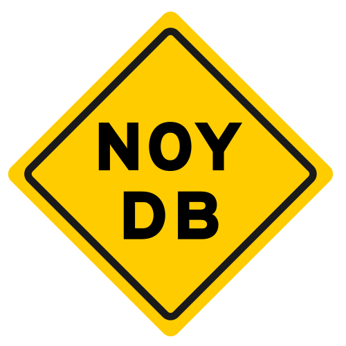
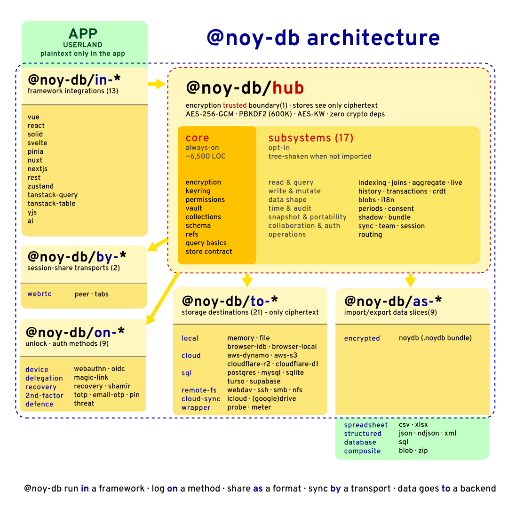

<div align="center">

<sub><a href="../../README.md">🇬🇧 English</a></sub>



# noy-db

## None Of Your DataBase
<sub><em>(เดิมย่อว่า: "None Of Your <strong>Damn Business</strong>")</em></sub>

**ข้อมูลของคุณ เครื่องของคุณ กุญแจของคุณ ไม่ใช่เซิร์ฟเวอร์ของใครอื่น**

ฐานข้อมูลเอกสารแบบ **เข้ารหัส, เน้นใช้งานออฟไลน์ก่อน, ไม่มีเซิร์ฟเวอร์** ตัวไลบรารีฝังอยู่ภายในแอปของคุณ จัดเก็บลงใน backend ที่คุณเลือก และไม่มีใครตรงกลาง — ไม่ว่าจะเป็นผู้ให้บริการคลาวด์ ผู้ดูแลระบบ ผู้ขายฐานข้อมูล หรือแม้แต่ noy-db เอง — ที่จะมองเห็นข้อมูลแบบเปิดเผย (plaintext) ได้

[](https://www.npmjs.com/package/@noy-db/hub)
[](../../LICENSE)
[](https://nodejs.org)
[](https://www.typescriptlang.org)
[](#zero-dependencies)
[](#encryption)

</div>

---

## ทำไม noy-db ถึงต่างจากคนอื่น

- **🔒 ความเป็นส่วนตัวเชิงโครงสร้าง (Hard privacy).** Store เห็นแต่ ciphertext เท่านั้น เข้ารหัสด้วย AES-256-GCM พร้อมกุญแจเฉพาะผู้ใช้ที่ derive จาก passphrase ผ่าน PBKDF2 ไม่ว่าคลาวด์จะถูกเจาะ ผู้ให้บริการจะถูกหมายศาล หรือ USB จะหายไป — **ทุกพื้นผิวเหล่านั้นเก็บแต่ ciphertext** ไม่มี dependencies สำหรับการเข้ารหัส — ใช้แค่ Web Crypto API
- **☁️ ไม่มีเซิร์ฟเวอร์ ทำงานได้ทุกที่.** ไม่มีเซิร์ฟเวอร์ noy-db ไม่ต้อง Docker ไม่ต้องใช้บริการ managed ตัวไลบรารีฝังในแอปของคุณ — ขนาด ~30 KB, dependency เป็น 0 ทำงานบน Node 18+, Bun, Deno, ทุกเบราว์เซอร์สมัยใหม่, Cloudflare Workers, Electron, mobile PWAs
- **📴 ใช้งานออฟไลน์ได้ก่อน.** ทุกการดำเนินการทำงานได้โดยไม่ต้องมีเครือข่าย ซิงค์เมื่อคุณต้องการ ไปยังที่ใดก็ได้ที่ต้องการ ไม่มีโหมด "ออนไลน์" ให้ต้องสลับ
- **👥 รองรับหลายผู้ใช้ ไม่ต้องมีเซิร์ฟเวอร์ auth.** มี 5 บทบาท (owner / admin / operator / viewer / client), สิทธิ์ระดับ collection, หมุนกุญแจอัตโนมัติเมื่อเพิกถอน keyring เดินทางไปกับข้อมูล
- **🧩 หนึ่ง core หลายสะพาน.** `@noy-db/hub` คือแกนกลาง encrypted document-store ส่วนแพ็กเกจเสริม `to-*` / `in-*` / `on-*` / `as-*` / `by-*` ประมาณ 55 ตัว ให้แอปที่มีอยู่เดิมยังคงใช้ที่เก็บข้อมูล, framework, วิธีปลดล็อค, รูปแบบ export และ session-share transport ที่ตัวเองชอบ — โดยไม่ต้องเปลี่ยนสิ่งอื่น
- **🔐 ฟีเจอร์การเข้ารหัสขั้นสูง.** ลำดับชั้น (tier) ต่อ record, deterministic encryption สำหรับ index ที่ค้นหาได้, การซิงค์แบบ peer-to-peer ผ่าน WebRTC, ที่เก็บ blob เข้ารหัส AES-256-GCM พร้อม deduplication, ETag ที่ derive ด้วย HKDF, audit ledger ที่ใช้ hash chain
- **🧪 ทดสอบกว่าพันเคส, CI ภายในหนึ่งนาที.** ทุก store / integration / auth / export package ทดสอบแบบ mock — CI ทำงานได้โดยไม่ต้องใช้ AWS, Google Drive, SFTP server หรือบริการจริงใด ๆ

> **`@noy-db/hub` คือเส้นแบ่งความน่าเชื่อถือ (trust boundary).** การเข้ารหัสเกิดขึ้นใน core ก่อนข้อมูลจะไปถึง store ใด ๆ แพ็กเกจอื่นทุกตัว — `to-*`, `in-*`, `on-*`, `as-*`, `by-*` — เป็นเพียงสะพานเสริมที่ไม่เคยเห็น plaintext
>
> **สถานะก่อน 1.0.** Privacy model หลัก, รูปแบบ envelope, keyrings, สิทธิ์ และ query DSL ทั้งหมดสร้างและทดสอบแล้ว Public API อาจยังเปลี่ยนแปลงตามคำติชมของผู้ใช้ก่อนเวอร์ชัน 1.0; การเปลี่ยนแปลงด้าน data migration และความปลอดภัยจะมีเอกสารกำกับ ยังไม่มี cryptographic audit จากภายนอก — ตั้งเป้าไว้ที่ v1.0

---

## ตัวอย่าง 30 วินาที

ขั้นต่ำ — ไม่มี framework ไม่มีคลาวด์ ไม่ต้องติดตั้งอะไรนอกจากสองแพ็กเกจ:

```ts
import { createNoydb } from '@noy-db/hub'
import { memory } from '@noy-db/to-memory'

const db = await createNoydb({
  store: memory(),
  user: 'alice',
  secret: 'correct-horse-battery-staple',
})

const vault = await db.openVault('acme')
const invoices = vault.collection<{ id: string; amount: number }>('invoices')

await invoices.put('inv-001', { id: 'inv-001', amount: 1200 })
console.log(await invoices.get('inv-001'))   // { id: 'inv-001', amount: 1200 }

await db.close()                               // ล้างกุญแจออกจากหน่วยความจำ
```

**สลับที่เก็บข้อมูลได้ในบรรทัดเดียว** — ส่วนที่เหลือเหมือนเดิม:

```ts
// บันทึกลงไฟล์
import { jsonFile } from '@noy-db/to-file'
store: jsonFile({ dir: './data' })

// PostgreSQL
import { postgres } from '@noy-db/to-postgres'
store: postgres({ client: myPool })

// S3
import { s3 } from '@noy-db/to-aws-s3'
store: s3({ bucket: 'my-vaults', client: myS3Client })
```

→ ดู backend อื่น ๆ ที่ **[Storage stores (`to-*`)](../packages/to-stores.md)** (extended cloud/SQL backends อยู่ใน [noy-db-to](https://github.com/vLannaAi/noy-db-to))

---

## รองรับหลายภาษาในตัว

`noy-db` มองภาษาเป็นเรื่องชั้นแรก ไม่ใช่เพิ่มทีหลัง บริการ [`i18n`](../services/i18n.md) (เปิดใช้แบบ opt-in) ให้คุณ:

- เก็บ field เดียวที่มีค่าในหลายภาษาในแต่ละ record (`i18nText({ languages: ['en', 'th', 'zh'] })`)
- จับคู่ field แบบ enum กับ dictionary ของ label ในหลายภาษา (`dictKey('status', ['draft', 'paid'])` แปลเป็น label ของแต่ละภาษา)
- Resolve ภาษาที่ต้องการตอนอ่าน โดยไม่แตะ ciphertext บน wire
- Dictionary เองก็ถูกเข้ารหัสและทำเวอร์ชัน — แม้แต่คำแปลของคุณก็เป็นความลับ
- Records, dictionaries, exports ทั้งหมดเป็น Unicode-clean — ภาษาไทย, จีน (中文), อาหรับ (العربية), เทวนาครี (हिंदी), ซีริลลิก, ฮีบรู ทุก script ที่ Web Crypto API และ storage backend ของคุณรองรับได้
- Export แบบ locale-aware — ผู้นำเข้า xlsx จะกลับ label ที่อ่านง่ายมาเป็น key ที่เสถียรอัตโนมัติ (เช่นเดียวกับ csv, json, ndjson, xml)

---

## ตระกูลแพ็กเกจ 5 ชุด

แต่ละ prefix อ่านเป็น preposition — โมเดลความคิดเหมือนเดิมเมื่อต้องขยายจาก vault ในไฟล์เดียวไปสู่ deployment คลาวด์แบบหลาย tenant

| Prefix | อ่านว่า | คืออะไร |
|---|---|---|
| **`to-`** | *"ข้อมูลไป **ไปยัง** backend"* | **ที่เก็บข้อมูล** — เป็นชิ้นเดียวที่สัมผัส ciphertext บน wire |
| **`in-`** | *"ทำงาน **ภายใน** framework"* | **Framework integrations** — bindings แบบ reactive |
| **`on-`** | *"คุณเข้า **ผ่าน** วิธีนี้"* | **การปลดล็อค / auth** — primitive แบบประกอบได้ |
| **`as-`** | *"export **เป็น** XLSX / JSON / ..."* | **Portable artefacts** — สอง tier authorization พร้อม audit ledger |
| **`by-`** | *"ซิงค์ **ผ่าน** ..."* | **Session-share transports** — สะพาน live-state ระหว่าง realm |

นอกจากนี้ยังมี hub (`@noy-db/hub`) และเครื่องมือเดี่ยว: `@noy-db/cli`, `create-noy-db` (ตัวสร้างโปรเจกต์)

---

## ความเป็นส่วนตัวที่ "แข็ง" คือจุดประสงค์

ในวิศวกรรมความเป็นส่วนตัว มีความแตกต่างที่ควรเรียกชื่อ

- **Soft privacy** เป็นคำสัญญา ผู้ให้บริการสัญญาว่าจะปกป้องข้อมูลของคุณ — ด้วย policy, การฝึกอบรมพนักงาน, ใบรับรองที่แขวนบนผนัง คุณต้องเชื่อใจ policy, ผู้คน, เจ้าของในอนาคต, เขตอำนาจศาล, การตอบสนองหมายศาล, ทีม breach-response ในวันที่แย่ที่สุด
- **Hard privacy** ขจัดความจำเป็นในการเชื่อใจนั้นออกไป ไม่มีใครอื่น *สามารถ* ผิดสัญญาได้ เพราะไม่มีใครอยู่ในตำแหน่งที่จะทำได้ พวกเขาไม่มีกุญแจ พวกเขาไม่เคยมีกุญแจ

`noy-db` เป็นเครื่องมือ hard-privacy ฝ่ายเดียวที่อ่าน record ได้คือฝ่ายที่ถือ passphrase — ไม่ว่าคลาวด์ของคุณจะถูกเจาะ ผู้ดูแลระบบจะมองดูตาราง ศาลจะสั่งให้ผู้ให้บริการ แล็ปท็อปจะถูกขโมย หรือ backup จะถูกทิ้งไว้บน Wi-Fi ของร้านกาแฟ — **ทุกพื้นผิวเหล่านั้นเก็บแต่ ciphertext**

ไม่มีขั้นตอน "เข้ารหัสบน wire ถอดรหัสที่ rest ชั่วครู่เพื่อประมวลผล" ไม่มีวิศวกร support ของ noy-db ที่มี recovery key — เราไม่ได้รันบริการและเราไม่ได้ครอบครอง key ใดเลย KEK อยู่ใน process memory ของคุณตามอายุของ session และจะถูกทำลายเมื่อคุณเรียก `db.close()`

### มุมมองทางจริยธรรมต่อ hard privacy

การเข้ารหัสที่แข็งแกร่งเป็นเทคโนโลยี dual-use สิ่งเดียวกันที่ปกป้องผู้เห็นต่าง นักข่าว ผู้รอดชีวิตจากการถูกล่วงละเมิด คนไข้ และชีวิตส่วนตัวของคนทั่วไปทุกคน — ก็สามารถปิดบังการกระทำที่ผิดกฎหมายหรือเป็นภัยได้เช่นกัน เราไม่แสร้งทำเป็นไม่รู้

จุดยืนของเรา: **ความสามารถในการเก็บ record ความคิด และจดหมายของตนเองให้เป็นความลับจากทุกคนอื่น — รวมถึงรัฐบาล นายจ้าง และบริษัทที่ขายซอฟต์แวร์ให้ — เป็นเรื่องพื้นฐาน เป็นสิ่งที่ผูกพันกับเอกราชส่วนบุคคล และเป็นสิทธิ ไม่ใช่ฟีเจอร์ที่เราเลือกจะมอบให้**

`noy-db` ไม่ตรวจสอบข้อมูลของคุณ มันทำไม่ได้ — นั่นคือจุดเชิงโครงสร้าง สิ่งที่คุณเลือกเก็บใน vault ของ `noy-db` และสิ่งที่คุณทำกับมัน เป็นเรื่องของคุณ ถ้าคุณใช้ `noy-db` ในบริบทที่มีข้อผูกพันทางกฎหมายหรือวิชาชีพ — GDPR, PDPA, HIPAA, PCI-DSS, retention, lawful-access rules, auditability, การเก็บ record ทางภาษี — ข้อผูกพันเหล่านั้นยังคงเป็นของคุณที่ต้องปฏิบัติตามกฎหมายของที่ที่คุณดำเนินงาน

---

## การเข้ารหัส

| ชั้น | อัลกอริทึม | วัตถุประสงค์ |
|---|---|---|
| Key derivation | PBKDF2-SHA256 (600K iterations) | Passphrase → KEK |
| Key wrapping | AES-KW (RFC 3394) | KEK ห่อ/แกะ DEKs |
| Data encryption | AES-256-GCM | DEK เข้ารหัส record |
| IV generation | CSPRNG | IV 12 byte ใหม่ทุกครั้งที่เขียน |
| Integrity | HMAC-SHA256 | Presence channel + blob eTags |

**ไม่มี dependencies สำหรับการเข้ารหัส** ทุกอย่างใช้ `crypto.subtle` — มีในตัวกับ Node 18+ และเบราว์เซอร์สมัยใหม่

---

## บทบาทและสิทธิ์

| บทบาท | อ่าน | เขียน | มอบ | เพิกถอน | Export |
|---|:-:|:-:|:-:|:-:|:-:|
| **owner** | ทั้งหมด | ทั้งหมด | ทุกบทบาท | ทั้งหมด | ได้ |
| **admin** | ทั้งหมด | ทั้งหมด | operator, viewer, client, admin | admin และต่ำกว่า | ได้ |
| **operator** | collection ที่ได้รับมอบ | collection ที่ได้รับมอบ | — | — | ตามขอบเขต ACL |
| **viewer** | ทั้งหมด | — | — | — | ได้ |
| **client** | collection ที่ได้รับมอบ | — | — | — | ตามขอบเขต ACL |

ทุก mutation (grant, revoke, rotate, elevate) เขียน entry ของ audit ledger แบบ hash-chain ระบบ tier ระดับ record (`collection.elevate()` / `demote()` / `delegate()` / โหมด invisibility / ghost) พร้อม handle เลื่อน tier แบบ scope (`vault.elevate(tier, { ttlMs, reason })` สำหรับการเขียนที่มีสิทธิพิเศษแบบจำกัดเวลา) อยู่ในบริการ [`history`](../services/history.md) และ [`team`](../services/team.md)

---

## ไม่เหมาะสำหรับ

- งาน analytics ระดับล้าน row
- SQL ฝั่งเซิร์ฟเวอร์บน plaintext — store ตาบอดโดยตั้งใจ
- งานที่ต้องให้ storage backend รัน join, filter หรือ aggregation บน plaintext
- งานที่เน้นการค้นหา เว้นแต่จะยอมรับ trade-off ของ deterministic encryption สำหรับ index ที่ค้นหาได้
- ทีมที่ต้องการ cryptography ที่ผ่าน audit แล้ววันนี้ — `noy-db` ยังไม่มี cryptographic audit จากภายนอก ตั้งเป้าไว้ที่ v1.0

การใช้งานจริงจังของ `noy-db` คือสำหรับ dataset ขนาดเล็กถึงกลางที่ sensitive ซึ่งเส้นแบ่งความเป็นส่วนตัวสำคัญกว่า throughput ของ query

---

## สถาปัตยกรรม

<picture>
  
</picture>

Store **เห็นแต่ ciphertext** การเข้ารหัสเกิดขึ้นใน core ก่อนข้อมูลจะไปถึง backend ใด ๆ — ผู้ดูแล DynamoDB, เจ้าของ S3 bucket, หรือใครก็ตามที่พบ USB stick ทั้งหมดเห็นแต่ blob ที่เข้ารหัสแล้ว

---

<a name="zero-dependencies"></a>
## ไม่มี dependency

ทุกแพ็กเกจมี runtime dependency เป็น 0 SDK เช่น `@aws-sdk/client-dynamodb`, `ssh2`, `pg`, `mysql2`, `zustand`, `react`, `vue`, `@tanstack/query-core` เป็น peer dependencies — คุณมีอยู่ในแอปอยู่แล้ว

แพ็กเกจ hub เองใช้แค่ `crypto.subtle` ซึ่งมีในตัวกับทุก runtime เป้าหมาย (Node ≥ 18, Bun, Deno, เบราว์เซอร์สมัยใหม่, Cloudflare Workers)

---

## ไปต่อที่ไหนดี

| ถ้าคุณต้องการ… | อ่าน |
|---|---|
| ดูสิ่งที่เปิดอยู่เสมอ (พื้นฐาน) | [`docs/core/`](../core/) |
| สำรวจ 24 บริการแบบ opt-in | [`docs/services/`](../services/) — ดัชนี + แคตาล็อก [SERVICES.md](../../SERVICES.md) |
| คัดลอก recipe เริ่มต้น | [`docs/recipes/`](../recipes/) — personal-notebook · accounting-app · realtime-crdt-app · analytics-app |
| เลือก storage backend | [`docs/packages/to-stores.md`](../packages/to-stores.md) |
| เลือก framework integration | [`docs/packages/in-integrations.md`](../packages/in-integrations.md) |
| เลือกวิธีปลดล็อค | [`docs/packages/on-auth.md`](../packages/on-auth.md) |
| เลือกรูปแบบ export | [`docs/packages/as-exports.md`](../packages/as-exports.md) |
| เลือก session-share transport | [`docs/packages/by-transports.md`](../packages/by-transports.md) |
| ดู workflow จริง | [`showcases/`](../../showcases/) |
| ตรวจสอบสิ่งที่ stable หรือกำลังจะมา | [`ROADMAP.md`](../../ROADMAP.md) |
| audit การตัดสินใจการออกแบบ | [`SPEC.md`](../../SPEC.md) |

---

## License

[MIT](../../LICENSE)

---

<div align="center">
  <sub>ข้อมูลของคุณ เครื่องของคุณ กุญแจของคุณ <b>None Of Your DataBase.</b></sub>
  <br>
  <sub><em>(เดิมและยังคงเรียกเป็นครั้งคราวว่า: "None Of Your <strong>Damn Business</strong>".)</em></sub>
</div>
